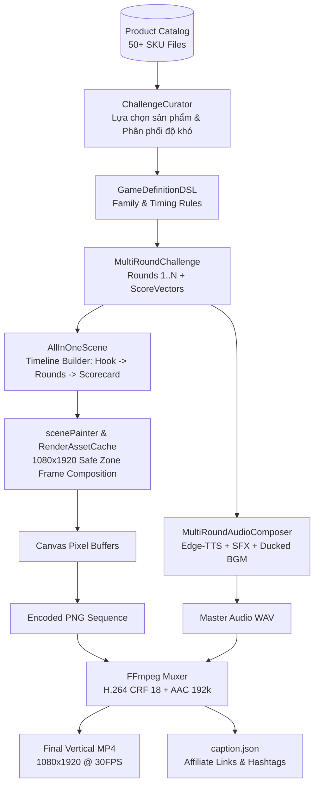

# auto-drawing — Universal AI Game Video Engine

Hệ thống **Modular Monolith** (TypeScript, Node.js ≥ 22) sản xuất video ngắn dạng đố vui tương tác dọc 9:16 (1080×1920) hoàn toàn tự động, phục vụ kênh giải trí, review và **affiliate marketing** (TikTok, YouTube Shorts, Facebook Reels). 

100% local-first, mã nguồn mở, chi phí vận hành ~0đ/video, tối ưu hoá cho độ giữ chân người xem (audience retention) và tính toàn vẹn dữ liệu.

---

## 🌟 Điểm nổi bật & Tính năng chính

1. **7 Game Mechanics Đa dạng (Được kiểm chứng viral)**:
   - **G1: Hi-Lo (`hi_lo`)**: So sánh giá 2 sản phẩm — Món B CAO HƠN hay THẤP HƠN món A?
   - **G2: Most Expensive (`most_expensive`)**: Tìm sản phẩm đắt nhất trong 3–4 món hàng.
   - **G3: Odd One Out (`odd_one_out`)**: Tìm kẻ lạc loài khác danh mục hoặc khác phân khúc.
   - **G5: One Away (`one_away`)**: Đoán chữ số bị che trong mức giá niêm yết (`189.?00₫`).
   - **G7: Grocery Basket (`grocery_basket`)**: Cầm ngân sách đi siêu thị — Tổng giỏ hàng ĐỦ TIỀN hay CHÁY TÚI?
   - **G9: Guess The Price (`guess_the_price`)**: Đoán khoảng giá thực tế của sản phẩm.
   - **G41: Deal Or Scam (`deal_or_scam`)**: Phân tích giá sale sốc — DEAL HỜI chính hãng hay BẪY SALE ẢO?

2. **Dynamic Multi-Round Engine**:
   - Tùy biến linh hoạt số vòng thi (`--rounds 2..5`) và thời lượng đếm ngược (`--timer 5.0..10.0s`).
   - Cấu trúc tâm lý học kịch bản 3 hồi: *Confidence Builder* (vòng 1 dễ tạo đà) → *Tension Creator* (vòng 2 sít sao) → *WTF Reveal* (vòng cuối bẻ lái cảm xúc).
   - Nhịp dựng không khoảng chết (*Zero Dead Air*): Vòng đếm ngược kích hoạt ngay tức thì khi câu hỏi xuất hiện.

3. **Hệ thống Âm thanh Đa tầng (Multi-layer Audio Bed)**:
   - Giọng đọc AI tự nhiên tiếng Việt qua **Microsoft Edge Neural TTS** (Nam Minh, Hoài My).
   - Tự động hạ âm lượng nhạc nền (Audio Ducking) khi có giọng đọc.
   - Hiệu ứng âm thanh (SFX) đếm ngược dồn dập và tiếng chuông reo/pháo hoa khi công bố đáp án.

4. **Bộ Renderer Tối ưu & Không phụ thuộc Browser**:
   - **Satori Frame Renderer (Mặc định)**: Sử dụng Satori & Rust engine (`@resvg/resvg-js`) siêu nhẹ (~17MB RAM), tích hợp **Smart Keyframe Caching** (nhận diện trạng thái scene để loại trừ render SVG trùng lặp, tăng tốc độ render gấp 3.5x–5x).
   - **Software Frame Renderer**: Bộ rasterizer thuần pixel CPU làm phương án dự phòng deterministic.
   - **Zero Browser Overhead**: Loại bỏ hoàn toàn Puppeteer/Chromium, tiết kiệm hàng trăm MB RAM và triệt tiêu độ trễ mạng CDP.

5. **An toàn Dữ liệu & Tiếp thị Liên kết (Data Integrity)**:
   - **Zero Data Invention**: Renderer tuyệt đối không tự bịa giá hoặc đoán mò đáp án; dữ liệu được xác thực chặt chẽ qua Two-layer Validator.
   - **Pixel-Scan Guard**: Tự động quét kiểm tra từng frame sau render để đảm bảo link affiliate không bao giờ bị lộ vào video (chỉ xuất hiện trong `caption.json` hoặc comment theo chuẩn chống vi phạm chính sách nền tảng).

6. **Hệ thống 5 UI Templates Sáng & Trực quan (High-Contrast Homemaker UI Templates)**:
   - **Tối ưu thị giác cho khán giả truyền hình & nội trợ**: Thiết kế theo phong cách gameshow "Hãy Chọn Giá Đúng", giải quyết triệt để vấn đề màn hình tối mỏi mắt. Thẻ card sản phẩm nền trắng `#ffffff`, viền bo mềm mại nổi khối, độ tương phản cao, chữ số to đậm chống mỏi mắt khi xem trên smartphone.
   - **5 Mẫu Template Sẵn sàng Triển khai**:
     - 🎯 `hay_chon_gia_dung` (Mặc định): Sân khấu gameshow Hãy Chọn Giá Đúng (Xanh dương hoàng gia - Vàng gold kim loại, đèn spotlight).
     - 🛒 `sieu_thi_gia_dinh`: Bách Hóa & Siêu Thị Gia Đình (Nền xanh lá tươi mát, thẻ viền đỏ nổi bật, thân thuộc và tin cậy).
     - 🍳 `bep_am_noi_tro`: Gian Bếp Ấm Cúng & Nội Trợ (Tông cam kem ấm áp pastel, bo góc 32px mềm mại, gần gũi với việc nội trợ).
     - ⚡ `gio_vang_san_deal`: Đại Hội Giờ Vàng Săn Deal (Đỏ cam rực lửa, đèn spotlight, giục giã và kích thích tâm lý săn sale).
     - 🏪 `tap_hoa_vui_ve`: Tiệm Tạp Hóa Bình Dân (Nền vàng chanh rực rỡ phối viền xanh ngọc teal, vui nhộn và bình dân).

---

## 📚 Bộ Tài Liệu Sản Xuất (Production Docs Suite)

Để phục vụ triển khai production, tích hợp tự động và mở rộng dự án lâu dài, hãy tham khảo các tài liệu chuyên sâu:

| Tài liệu | Mô tả |
| :--- | :--- |
| 📖 **[docs/GETTING_STARTED.md](docs/GETTING_STARTED.md)** | Hướng dẫn onboarding từ A-Z: cài đặt môi trường, asset generation, render video đầu tiên & Web Studio. |
| 🏗️ **[docs/ARCHITECTURE.md](docs/ARCHITECTURE.md)** | Kiến trúc chi tiết: Modular Monolith bounded contexts, sơ đồ tuần tự pipeline, hợp đồng dữ liệu & chuẩn Safe Zone. |
| 🧩 **[docs/EXTENSION_GUIDE.md](docs/EXTENSION_GUIDE.md)** | Hướng dẫn phát triển mở rộng: thêm Game Mechanic mới với TypeScript, thêm SKU sản phẩm, đổi giọng AI & themes. |
| 🛡️ **[docs/AFFILIATE_SAFETY.md](docs/AFFILIATE_SAFETY.md)** | Chính sách bảo vệ tiếp thị liên kết: Zero Data Invention, Pixel-Scan Guard, cấu trúc `caption.json` & chống bóp tương tác. |
| 🤝 **[CONTRIBUTING.md](CONTRIBUTING.md)** | Hướng dẫn đóng góp: Tiêu chuẩn code, quy trình kiểm thử Vitest, Conventional Commits & PR checklist. |

---

## 🚀 Cài đặt & Khởi động Nhanh

### 1. Yêu cầu Môi trường
- **Node.js**: Phiên bản `>= 22.12`
- **FFmpeg**: Đã cài đặt trên hệ điều hành và có trong `PATH` (hoặc cài đặt tự động qua `@ffmpeg-installer/ffmpeg`).
- **Zero Browser Dependencies**: Không yêu cầu cài đặt trình duyệt Chrome/Edge hay bất kỳ headless browser daemon nào.

### 2. Cài đặt Dependencies
```bash
# Cài đặt core engine dependencies
npm install

# Cài đặt Web Studio dependencies
npm --prefix studio install
```

### 3. Khởi tạo Tài nguyên Mẫu (Bắt buộc trước lần chạy đầu tiên)
Dự án sử dụng cơ chế sinh asset offline deterministic:
```bash
npm run assets:generate   # Sinh 50 ảnh mẫu PNG 512×512, hiệu ứng SFX và nhạc nền mẫu
```

### 4. Kiểm tra Toàn bộ Hệ thống
Chạy kiểm thử toàn diện (TypeScript compilation + ESLint + 80+ Vitest test suites):
```bash
npm run verify
```

---

## 📖 Hướng dẫn Sử dụng

### 1. Dòng lệnh CLI (`bin/game.js`)

#### A. Xuất 1 Video Multi-Round Hoàn chỉnh
Chạy kịch bản 3 vòng chơi với cơ chế `hi_lo` cùng giao diện sân khấu Hãy Chọn Giá Đúng:
```bash
node bin/game.js render --mode multi --mechanic hi_lo --rounds 3 --timer 5.0 --theme hay_chon_gia_dung --seed 839271
```
*Tùy chọn:*
- `--mechanic`: Một trong 7 cơ chế (`hi_lo`, `most_expensive`, `odd_one_out`, `one_away`, `grocery_basket`, `guess_the_price`, `deal_or_scam`).
- `--rounds`: Số vòng chơi (mặc định: `3`).
- `--timer`: Số giây đếm ngược mỗi vòng (mặc định: `5.0`).
- `--theme`: Mẫu giao diện UI (mặc định: `hay_chon_gia_dung`). Danh sách các mẫu:
  - `hay_chon_gia_dung`: Sân khấu Hãy Chọn Giá Đúng (Xanh dương hoàng gia - Vàng gold kim loại, spotlight)
  - `sieu_thi_gia_dinh`: Bách Hóa & Siêu Thị Gia Đình (Xanh lá tươi mát - Đỏ tươi)
  - `bep_am_noi_tro`: Gian Bếp Ấm Cúng & Nội Trợ (Cam kem pastel ấm áp)
  - `gio_vang_san_deal`: Đại Hội Giờ Vàng Săn Deal (Đỏ cam rực lửa, spotlight)
  - `tap_hoa_vui_ve`: Tiệm Tạp Hóa Bình Dân (Vàng chanh - Xanh teal vui nhộn)
  - *(Các mẫu phong cách retro/arcade khác: `tv_game_show`, `clean_shopping`, `cyber_arcade`, `street_quiz`)*
- `--seed`: Số nguyên ngẫu nhiên để tái lập video (deterministic).
- `--renderer`: Bộ kết xuất khung hình: `satori` (mặc định — siêu nhẹ, cực nhanh với keyframe cache) hoặc `software` (fallback thuần CPU).
- `--exportDir`: Thư mục chứa video MP4 xuất ra (mặc định: `export/`).

#### B. Xuất Video Hàng loạt qua đêm (Batch Mode)
Sản xuất 50 video tự động với worker pool song song:
```bash
node bin/game.js batch --count 50 --mechanics hi_lo,deal_or_scam,grocery_basket
```
- Tự động chạy chế độ *Fail-Forward*: nếu 1 video bị lỗi sản phẩm, các video khác trong batch vẫn tiếp tục kết xuất bình thường.
- Báo cáo chi tiết sau batch được ghi tại: `export/batch-<timestamp>/batch_report.json`.

#### C. Xem danh sách Sản phẩm trong Kho dữ liệu
```bash
npm run products:list
# hoặc: node bin/game.js products list
```

#### D. Kiểm tra Trạng thái Hàng đợi và Nhật ký Job
```bash
node bin/game.js queue status
node bin/game.js logs --gameId hi_lo_839271
```

---

### 2. Giao diện Web Studio trực quan (Next.js)

Dự án tích hợp sẵn ứng dụng Web Studio giúp tùy biến và xem trước kịch bản video trên trình duyệt:

```bash
npm run studio:dev
```
Truy cập: **`http://localhost:3000/studio`**

*Các tính năng trong Studio:*
- **Trực quan hoá Kịch bản**: Lựa chọn mechanic, tuỳ chỉnh số vòng, chỉnh sửa câu hỏi và danh sách sản phẩm.
- **Xem trước Bố cục HTML**: Xem trước giao diện video 1080×1920 ở mọi mốc thời gian (Hook, Vòng 1, Đếm ngược, Reveal, Scorecard).
- **Kết xuất MP4 Trực tiếp**: Bấm nút **"🎬 Render Video MP4"** để máy chủ thực thi render ngầm và tải video thành phẩm về máy.

---

## 🏗️ Kiến trúc Hệ thống (Architecture)

### 1. Sơ đồ Luồng Dữ liệu (Pipeline Flow)



### 2. Cấu trúc Thư mục (Modular Monolith)

```
src/
├── challenge/        # Dynamic Multi-round Engine: Curator, Scorer, Types
├── definitions/      # Khai báo DSL cho 7 mechanics (g1, g2, g3, g5, g7, g9, g41)
├── game/             # Legacy single-round engine & rng
├── product/          # ProductProvider (quản lý SKU, cache in-memory, file watch)
├── validator/        # Bộ kiểm tra 2 tầng (Schema Zod + Game Logic Invariants)
├── scene/            # Xây dựng dòng thời gian (Timeline, AllInOneScene)
├── audio/            # Quản lý giọng đọc TTS (Edge-TTS, Piper), SFX và BGM
├── render/           # Động cơ kết xuất khung hình (scenePainter, assetCache, canvas)
├── queue/            # Quản lý hàng đợi job bất đồng bộ file-based
├── observability/    # Logging JSON, timing metrics, báo cáo batch
└── cli/              # Entry point dòng lệnh `bin/game.js`
studio/               # Next.js 15 Web Studio (App router, Tailwind, Preview APIs)
products/             # Database sản phẩm mẫu (`p001.json` ... `p050.json`)
assets/               # Font chữ, audio bed, hiệu ứng âm thanh SFX
```

### 3. Quy tắc Ràng buộc Phụ thuộc (Dependency Rule)
Được kiểm soát nghiêm ngặt bởi ESLint (`import/no-restricted-paths`):
```
queue → validator → game / challenge → {audio, scene} → render → observability
```
- Tầng `render` không phụ thuộc ngược vào domain `game` hoặc `scene`.
- Tầng `challenge` độc lập với cách hiển thị đồ hoạ.

---

## 🧩 Hướng dẫn Mở rộng (Extension Guide)

### 1. Thêm một Game Mechanic Mới (Ví dụ: `g10_mystery_box`)

Để bổ sung một cơ chế trò chơi mới, bạn thực hiện qua 4 bước:

#### Bước 1: Khai báo DSL Game trong `src/definitions/`
Tạo file mới `src/definitions/g10_mystery_box.ts`:
```typescript
import type { GameDefinitionDSL } from '../challenge/types';
import { gameDefinitionSchema } from '../challenge/types';

export const g10Definition: GameDefinitionDSL = {
  id: 'g10_mystery_box',
  family: 'mystery_choice',
  name: 'Hộp Quà Bí Ẩn',
  targetDuration: 38.0,
  inputs: {
    countPerRound: 3,
    requiredFields: ['productId', 'name', 'price', 'image'],
  },
  rounds: [
    {
      round: 1,
      type: 'confidence_builder',
      targetDifficulty: 0.3,
      timerSeconds: 5.0,
      hookText: 'Chọn 1 trong 3 hộp quà: Hộp nào có giá trị cao nhất?',
    },
  ],
  presentation: {
    layout: 'all_in_one_comparison',
    actionButtons: ['HỘP A', 'HỘP B', 'HỘP C'],
  },
};

gameDefinitionSchema.parse(g10Definition);
```

#### Bước 2: Bổ sung Logic Curation trong `src/challenge/ChallengeCurator.ts`
Thêm nhánh xử lý câu hỏi, đáp án và gán `mechanic` cho round:
```typescript
else if (dsl.id === 'g10_mystery_box') {
  choices = selectedProducts.map((p, i) => ({
    id: String.fromCharCode(65 + i),
    label: `Hộp ${String.fromCharCode(65 + i)}`,
    isCorrect: p.productId === bestProduct.productId,
    value: p.price,
  }));
  correctAnswer = winningChoice.id;
  question = 'Hộp quà nào đắt tiền nhất?';
  revealText = `Hộp ${winningChoice.id} trị giá ${bestProduct.price.toLocaleString('vi-VN')}₫!`;
}
```

#### Bước 3: Định nghĩa Giao diện hiển thị trong `src/render/scenePainter.ts`
Trong hàm `drawMultiRoundProducts`, bổ sung xử lý giao diện thẻ sản phẩm khi `round.mechanic === 'mystery_box'`.

#### Bước 4: Viết Test Xác minh
Thêm test case mới vào `test/challenge/all-mechanics-curator.test.ts` và `test/render/all-mechanics-painter.test.ts`.

---

### 2. Thêm Sản phẩm Mới vào Kho (`products/`)

Mỗi sản phẩm là một file JSON độc lập đặt trong thư mục `products/` (ví dụ: `products/p051.json`):
```json
{
  "productId": "p051",
  "name": "Tai nghe chống ồn Sony WH-1000XM5",
  "price": 6990000,
  "originalPrice": 8490000,
  "currency": "VND",
  "category": "electronics",
  "brand": "Sony",
  "image": "assets/images/p051.png",
  "affiliate_link": "https://shope.ee/example",
  "updatedAt": "2026-09-16"
}
```
*Lưu ý:*
- File ảnh phải có định dạng **PNG**.
- Đặt ảnh tương ứng tại `assets/images/p051.png`.

---

### 3. Tùy biến Giọng đọc & Âm nhạc (Voice & Audio Customization)

#### Cấu hình Giọng đọc Edge-TTS
Trong `src/audio/EdgeTtsEngine.ts`, bạn có thể chỉ định giọng đọc AI theo danh sách Microsoft Azure Neural:
- `vi-VN-NamMinhNeural` (Giọng nam miền Bắc, trầm ấm, dứt khoát)
- `vi-VN-HoaiMyNeural` (Giọng nữ miền Bắc, truyền cảm, cuốn hút)

#### Thay đổi Nhạc nền (BGM)
Thêm file nhạc `.wav` 44.1kHz stereo vào `assets/audio/music/` và chỉ định trong options:
```typescript
await audioComposer.composeAudio(challenge, timeline, {
  rootDir: process.cwd(),
  outputPath: 'output.wav',
  musicTrack: 'tension_01', // Tên file nhạc trong assets/audio/music/
  musicVolume: 0.18,        // Âm lượng nền (0.0 - 1.0)
});
```

---

### 4. Tùy biến Mẫu Giao diện (UI Theming)

Hệ thống quản lý bảng màu và giao diện tập trung tại `src/core/theme/themes.ts`. Bạn có thể dễ dàng định nghĩa thêm theme mới tuân theo interface `VisualTheme`:

```typescript
import { BUILTIN_THEMES, VisualTheme } from './src/core/theme';

export const TET_HOLIDAY_THEME: VisualTheme = {
  id: 'tet_holiday' as any,
  name: 'Chợ Tết Truyền Thống',
  colors: {
    backgroundGradient: ['#b91c1c', '#7f1d1d'],
    stageOverlay: 'spotlight',
    cardBackground: '#ffffff', // Card nền trắng tương phản cao chuẩn nội trợ
    cardBorder: '#f59e0b',
    cardShadow: '0 20px 35px rgba(185, 28, 28, 0.4)',
    accent: '#facc15',
    textPrimary: '#0f172a',    // Chữ đậm dễ đọc
    textSecondary: '#475569',
    countdownRing: '#f59e0b',
    revealBannerSuccess: '#16a34a',
    revealBannerWarning: '#dc2626',
  },
  typography: {
    fontFamilyHeadline: 'Be Vietnam Pro',
    fontFamilyBody: 'Inter',
    fontFamilyPrice: 'Montserrat',
    textTransformHeadline: 'uppercase',
  },
  geometry: {
    cardBorderRadius: 28,
    cardBorderWidth: 4,
    glowIntensity: 12,
  },
  assets: {
    bgmTrack: 'audio/bgm/gameshow_suspense.mp3',
    correctSfx: 'audio/sfx/win_chime.wav',
    wrongSfx: 'audio/sfx/buzzer_wrong.wav',
    countdownSfx: 'audio/sfx/ticking_tension.wav',
  },
};
```

Sau đó sử dụng trực tiếp qua CLI: `--theme tet_holiday` hoặc chi tiết hơn tại **[docs/EXTENSION_GUIDE.md](docs/EXTENSION_GUIDE.md)**.

---

## 🛠️ Xử lý Sự cố Thường gặp (Troubleshooting)

| Mã lỗi / Cảnh báo | Nguyên nhân | Cách khắc phục |
| :--- | :--- | :--- |
| `E_FFMPEG_MISSING` | Môi trường chưa tìm thấy binary `ffmpeg`. | Cài đặt FFmpeg hoặc cấu hình biến môi trường `FFMPEG_PATH`. |
| `W_ASSET_PLACEHOLDER` | Chưa có ảnh sản phẩm PNG tương ứng trong `assets/images/`. | Chạy `npm run assets:generate` hoặc bổ sung ảnh PNG đúng đường dẫn. |
| `W_LAYOUT_OVERLAP` | Tên sản phẩm quá dài hoặc toạ độ text vượt khỏi khung card. | Hệ thống tự động đẩy toạ độ giá xuống dưới (`statusLabelY`), kiểm tra lại độ dài tên sản phẩm nếu vẫn báo warning. |
| `E_AFFILIATE_BURNED_IN` | Pixel scan phát hiện link affiliate bị vẽ đè lên khung hình video. | Kiểm tra các hàm `canvas.drawText`, tuyệt đối không in trường `affiliate_link` lên Canvas. |
| `INSUFFICIENT_DISK_SPACE` | Ổ đĩa còn trống dưới 2GB. | Dọn dẹp thư mục `temp/` hoặc giải phóng dung lượng đĩa trước khi batch. |

---

## 📜 Giấy phép & Đóng góp
- **Giấy phép**: Dự án được phân phối theo giấy phép MIT. Toàn bộ mã nguồn hoàn toàn miễn phí cho mục đích thương mại và phát triển kênh affiliate cá nhân/doanh nghiệp.
- **Đóng góp**: Vui lòng đọc kĩ **[CONTRIBUTING.md](CONTRIBUTING.md)** để nắm rõ quy chuẩn coding standards, viết tests và quy trình gửi Pull Request.
