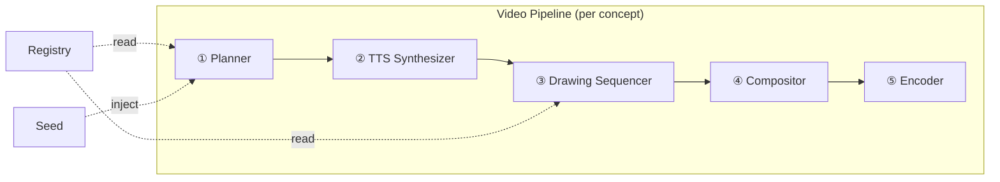
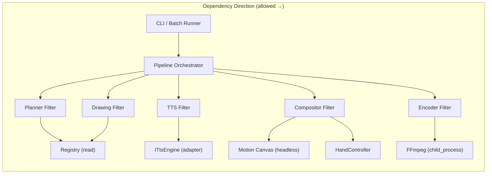
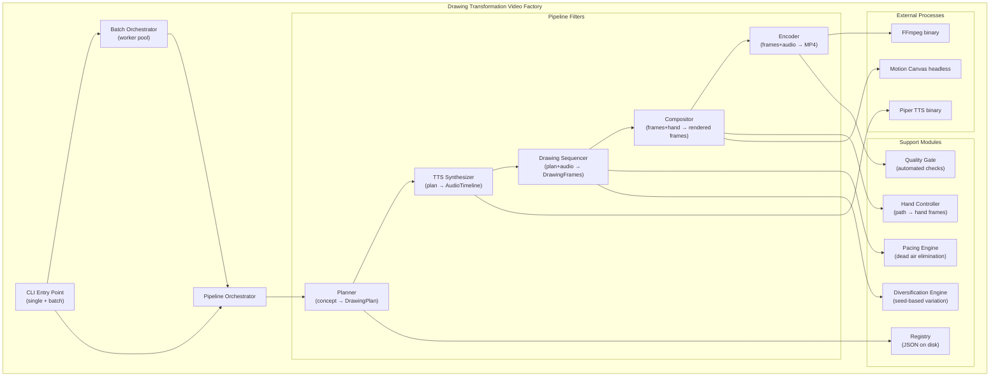
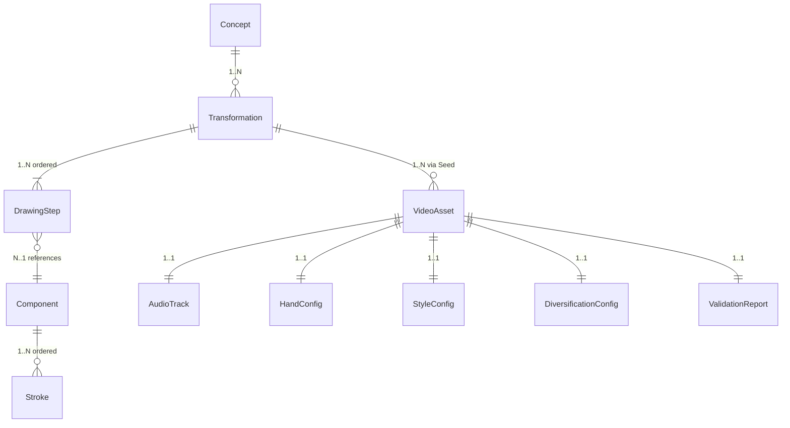

# Architecture Spine — Drawing Transformation Video Factory

## Design Paradigm

**Pipes-and-Filters** — mỗi video được sản xuất qua một pipeline 5 giai đoạn tuần tự. Mỗi giai đoạn (filter) là một module độc lập, nhận input có kiểu rõ ràng và trả output có kiểu rõ ràng. Không có shared mutable state giữa các filter — data flows forward.



**Lý do:** Pipeline tuyến tính phản ánh chính xác quy trình sản xuất video (PRD §1 Vision); mỗi filter có thể test độc lập; batch chạy N pipeline instances song song.

## Invariants & Rules

### AD-1 — Pipeline filter contract `[ADOPTED]`

- **Binds:** FR-4 through FR-20, NFR-1
- **Prevents:** Filters dùng interface khác nhau, gây coupling và silent failures
- **Rule:** Mỗi filter implement interface `IFilter<TIn, TOut>` với method duy nhất `execute(input: TIn, ctx: PipelineContext): Promise<Result<TOut, PipelineError>>`. `PipelineContext` mang Seed, config, logger. Filter không được giữ state giữa các lần gọi.

### AD-2 — Language & runtime: TypeScript trên Node.js `[ADOPTED]`

- **Binds:** all
- **Prevents:** Polyglot drift (Python cho TTS, TS cho rendering) gây phức tạp build/deploy
- **Rule:** Toàn bộ application code viết bằng TypeScript, chạy trên Node.js. External tools (FFmpeg, Piper TTS binary) gọi qua child_process spawn với typed wrappers. Không dùng Python subprocess trừ khi external tool bắt buộc.

### AD-3 — TTS engine: adapter pattern

- **Binds:** FR-10, NFR-3, NFR-5
- **Prevents:** Hard-code Piper, không thể swap engine khi chất lượng không đạt
- **Rule:** TTS module expose interface `ITtsEngine { synthesize(text: string, lang: string, opts: TtsOptions): Promise<AudioSegment> }`. Default implementation gọi Piper binary. `[ASSUMPTION]` Dùng archived `rhasspy/piper` MIT release; nếu chất lượng Vietnamese không đạt → swap sang Edge TTS (online, miễn phí nhưng cần internet) hoặc Kokoro TTS mà không sửa pipeline code.

### AD-4 — Registry: JSON-on-disk, single writer

- **Binds:** FR-1, FR-2, FR-3, FR-3b
- **Prevents:** DB dependency phá vỡ local-first; concurrent write corruption
- **Rule:** Registry là thư mục `registry/` chứa JSON files (1 file = 1 Component). CLI/Ingestion tool là writer duy nhất (FS lock trên write). Pipeline workers chỉ read — load toàn bộ vào memory at startup (≤ 500ms per FR-1). Component schema: `{ id, type, subject, geometry, boundingBox, strokeOrder, style, hook_ref, ingestion_path, llm_retry_count, source_image?, createdAt }`.

### AD-5 — Rendering: Motion Canvas headless → frame sequence → FFmpeg mux

- **Binds:** FR-13, FR-13b, FR-13c, FR-14, FR-16, NFR-3
- **Prevents:** Browser GUI dependency; non-deterministic render; Remotion license risk
- **Rule:** Compositor filter dùng Motion Canvas headless API để render từng frame thành PNG sequence (1080×1920). Encoder filter dùng FFmpeg (`libx264 -crf 18 -preset fast`) để mux frames + audio → MP4. `[ASSUMPTION]` Motion Canvas headless render 30fps 1080×1920 không cần browser display — cần verify R0.

### AD-6 — Immutable pipeline data

- **Binds:** all filters, NFR-2
- **Prevents:** Shared mutable state gây race conditions trong batch mode; non-reproducible output
- **Rule:** Data flowing giữa filters là immutable typed objects. Mỗi filter nhận input, tạo output mới — không mutate input. Side effects chỉ ở hai đầu pipeline: đọc Registry (đầu) và ghi file MP4 + metadata JSON (cuối).

### AD-7 — Batch: bounded worker pool

- **Binds:** FR-17, FR-18, NFR-3
- **Prevents:** Memory overflow khi batch 100+ concepts; uncontrolled parallelism crash hệ thống
- **Rule:** Batch orchestrator dùng worker pool size = `WORKER_POOL_MAX = Math.min(os.cpus().length - 1, 3)` — giới hạn cứng ở 3 workers cho đến khi benchmark R0 xác nhận RAM footprint thực tế của Motion Canvas headless (xem ADR-01). Mỗi worker chạy 1 pipeline instance tại một thời điểm. Queue manager (in-process, FIFO) phân phối concepts. Tổng RAM usage phải ≤ 4GB (NFR-3) — nếu vượt, worker bị throttle. Nếu benchmark R0 cho thấy RAM > 3.5GB ở 3 workers, giảm xuống 2.

### AD-8 — Error boundary: Result type + fail-forward trong batch

- **Binds:** FR-19, NFR-1
- **Prevents:** Silent failures (video hỏng gắn nhãn thành công); batch crash khi 1 concept lỗi
- **Rule:** Mỗi filter trả `Result<T, PipelineError>`. Khi error: (1) single mode → throw, user thấy lỗi ngay; (2) batch mode → log error kèm concept ID + filter name + error code, đánh dấu concept `status: failed`, tiếp tục concept kế tiếp. Cuối batch: tổng hợp report `{ passed: [...], failed: [...], skipped: [...] }`.

### AD-9 — Seed determinism

- **Binds:** FR-6, FR-18, NFR-2
- **Prevents:** Non-reproducible output khi replay cùng concept + seed
- **Rule:** Seed (uint64) inject ở đầu pipeline qua `PipelineContext.seed`. Mọi random operation (Diversification: màu, góc, BGM pick; Pacing: timing jitter) phải dùng seeded PRNG (`seedrandom` lib hoặc tương đương). Filter không được dùng `Math.random()`. Determinism ở tầng logic — pixel-level có thể khác giữa OS/GPU do anti-aliasing.

### AD-10 — Hand Engine contract

- **Binds:** FR-13, FR-13b
- **Prevents:** Coupling giữa Drawing geometry generation và Hand visual rendering
- **Rule:** `HandController.computeFrames(segments: PathSegment[], config: HandConfig): HandFrame[]` — tính toán position/rotation/scale/opacity cho mỗi frame dựa trên path geometry. Compositor nhận `HandFrame[]` và composite lên canvas. Drawing module không biết Hand module tồn tại; Hand module không biết canvas content — chỉ biết path geometry.

### AD-11 — Audio-visual sync: TTS-driven timeline `[ADOPTED]`

- **Binds:** FR-11, FR-12
- **Prevents:** Drawing speed cố định gây desync với voice; Dead Air
- **Rule:** TTS Synthesizer trả `AudioTimeline { segments: { text, startMs, endMs, audioBuffer }[] }`. Drawing Sequencer nhận `AudioTimeline` và co giãn tốc độ vẽ mỗi step để khớp segment tương ứng — **speed factor tối đa 1.8x** (thay vì 2.0x per FR-11; xem ADR-03). Nếu một segment yêu cầu speed > 1.8x, Planner **phải** rút ngắn TTS text hoặc chèn natural pause filler — không được tăng speed vượt cap. Khoảng trống > 500ms giữa segments → Pacing Engine chèn SFX/BGM filler. Quality Gate ghi `avSyncDeltaMs` (delta ms giữa timestamp đầu câu thoại và timestamp đầu nét tương ứng) vào `ValidationReport` — nếu > 500ms: flag `needs-review`.

### AD-12 — External process timeout contract

- **Binds:** FR-10 (Piper TTS), FR-16 (FFmpeg encoder), NFR-1
- **Prevents:** Worker pool deadlock khi external binary treo vô thời hạn; toàn bộ batch bị frozen
- **Rule:** Mọi `child_process.spawn` call phải được wrap với timeout cứng:
  - **Piper TTS:** `timeout = Math.ceil(text.length / 10 + 2) * 1000` ms
  - **FFmpeg encoder:** `timeout = frameCount * 200` ms (tối đa 120s)
  - **Motion Canvas headless:** `timeout = 90_000` ms (90s hard cap)
  - Khi timeout xảy ra: gọi `process.kill('SIGKILL')`, trả `Result.err({ code: 'PROCESS_TIMEOUT', filter, conceptId })`, worker được giải phóng ngay lập tức. Không bao giờ để Promise unresolved trong worker.

### AD-13 — Temp directory lifecycle

- **Binds:** FR-17 (Batch), NFR-1 (Reliability), NFR-3 (Performance)
- **Prevents:** Disk exhaustion cascade do leaked PNG frame sequences; cross-concept contamination
- **Rule:**
  - Mỗi pipeline instance dùng isolated temp dir: `temp/{conceptId}-{timestamp}/`
  - Cleanup **bắt buộc** xảy ra trong `finally` block của Pipeline Orchestrator — không phụ thuộc success hay failure path
  - **Pre-flight check** bắt buộc trước khi Batch Orchestrator khởi động: disk space còn trống ≥ 2GB; nếu không đủ → abort batch sớm với `INSUFFICIENT_DISK_SPACE` error, không để batch chạy rồi fail giữa chừng
  - Estimated temp usage per concurrent instance: ~500MB (PNG sequence) — document trong onboarding

### AD-14 — Registry atomic write + startup health check

- **Binds:** FR-1, FR-2, FR-3, NFR-1
- **Prevents:** Corrupt Component JSON sau interrupted write; 1 file hỏng block toàn bộ Registry hoặc gây silent data loss
- **Rule:**
  - **Atomic write pattern:** Writer ghi ra `{id}.tmp.json` → validate JSON schema (zod) → `fs.rename(tmp, final)`. Nếu process bị kill giữa chừng: chỉ file `.tmp` bị hỏng, file `.json` chính không bị ảnh hưởng.
  - **Startup validation:** Registry loader scan tất cả `*.json` files, parse từng cái; file nào fail parse thì log warning kèm filename — nhưng **không abort** nếu số lượng fail < 10% tổng số component.
  - **Startup gate:** Nếu ≥ 10% component fail parse → abort với `REGISTRY_CORRUPTION_THRESHOLD` error (yêu cầu operator can thiệp).
  - Expose `registry.healthCheck(): { loaded: number, failed: string[] }` — kết quả được log trong batch pre-flight.



## Consistency Conventions

| Concern | Convention |
| --- | --- |
| **Naming (entities)** | PascalCase cho types/interfaces (`DrawingStep`, `PipelineContext`). camelCase cho variables/functions. kebab-case cho file names (`drawing-step.ts`). Component IDs: `<subject>_<part>` lowercase snake (e.g. `bear_left_ear`). |
| **Naming (directories)** | Flat kebab-case: `src/filters/`, `src/registry/`, `src/tts/`, `src/hand/`, `src/audio/`. |
| **Data & formats** | IDs: `nanoid` 12-char. Dates: ISO 8601 UTC. Durations: milliseconds (integer). Coordinates: pixels (float, origin top-left). Angles: radians internally, degrees in config/display. |
| **Error shapes** | `PipelineError { code: string, filter: string, conceptId: string, message: string, cause?: Error }`. Error codes: `REGISTRY_NOT_FOUND`, `DSL_VALIDATION_FAILED`, `TTS_SYNTHESIS_FAILED`, `RENDER_TIMEOUT`, `ENCODE_FAILED`, `BOUNDS_EXCEEDED`. |
| **Config** | Single `config.json` at project root. Runtime overrides via CLI flags. Per-concept overrides via concept JSON fields. Hierarchy: CLI flag > concept field > config.json > hardcoded default. |
| **Logging** | Structured JSON logs via `pino`. Each filter logs `{ filter, conceptId, durationMs, status }` on completion. Batch runner logs summary on finish. |
| **File output** | `output/{conceptId}/` per video: `video.mp4`, `metadata.json`, `timeline.json`. Batch summary: `output/batch-<timestamp>.json`. |

## Stack

| Name | Version | Note |
| --- | --- | --- |
| Node.js | ≥ 22 LTS | Runtime |
| TypeScript | ≥ 5.6 | Language |
| Motion Canvas | latest (MIT) | Headless rendering — `[ASSUMPTION]` verify headless 1080×1920 at R0 |
| Piper TTS | rhasspy/piper v2023.11.14-2 (archived MIT) | Vietnamese voice `vi_VN-vais1000-medium`. Use ONLY archived MIT release. DO NOT use `piper-phonemize` or active GPL-3.0 branch |
| FFmpeg | ≥ 7.x (LGPL build) | Video encoding H.264/AAC |
| pino | latest | Structured logging |
| nanoid | latest | ID generation |
| seedrandom | latest | Seeded PRNG |
| sharp | latest | Image processing (hand asset compositing fallback) |
| zod | latest | Runtime schema validation (DSL, config) |
| openai | latest | `IVisionParser` default impl — GPT-4o Vision (one-time ingestion cost only) |
| @google/generative-ai | latest | `IVisionParser` alternative impl — Gemini Vision (swap via config) |

## Structural Seed



```text
auto-drawing/
  src/
    cli/             # CLI entry point, argument parsing
    pipeline/        # Pipeline orchestrator, filter interface, context
    filters/
      planner/       # Concept → DrawingPlan (FR-4, FR-5)
      tts/           # DrawingPlan → AudioTimeline (FR-10, FR-11)
      drawing/       # Plan+Audio → DrawingFrameSequence (FR-7, FR-8, FR-9)
      compositor/    # Frames+Hand → RenderedFrames (FR-13, FR-13b, FR-13c, FR-14)
      encoder/       # Frames+Audio → MP4 (FR-16)
    registry/        # Component storage, DSL validation, SVG ingestion (FR-1, FR-2, FR-3)
    hand/            # HandController, HandFrame computation (FR-13)
    audio/           # Pacing engine, SFX/BGM mixing (FR-11, FR-12)
    diversification/ # Seed-based variation engine (FR-18)
    quality/         # Quality gate checks, validation report (FR-19)
    shared/          # Types, errors, config, utils, PRNG
  registry/          # Component JSON files (data, not code)
  assets/
    hands/           # 2D Hand PNG assets + pivot metadata
    textures/        # Paper/chalkboard background textures
    sfx/             # Drawing sound effects
    bgm/             # Background music tracks
  config.json        # Default configuration
  package.json
  tsconfig.json
```

### Core Entity Relationships



## Capability → Architecture Map

| Capability (PRD) | Lives in | Governed by |
| --- | --- | --- |
| FR-1 Registry Store | `src/registry/`, `registry/` | AD-4 |
| FR-2 DSL Generation | `src/registry/dsl-validator.ts` | AD-4, zod schema |
| FR-3 SVG Ingestion | `src/registry/svg-ingestion.ts` | AD-4 |
| FR-3b Image Ingestion `[SPIKE-GATED]` | `src/registry/vision-ingestion.ts`, `src/registry/vision-mapper.ts` | ADR-02, IVisionParser adapter |
| FR-4 Concept Creation | `src/filters/planner/` | AD-1 |
| FR-5 Scoring | `src/filters/planner/scorer.ts` | AD-1 |
| FR-6 Seed Determinism | `src/shared/prng.ts`, `PipelineContext` | AD-9 |
| FR-7 Drawing Geometry | `src/filters/drawing/` | AD-1, AD-6 |
| FR-8 Geometry Validation | `src/filters/drawing/validator.ts` | AD-1, AD-8 |
| FR-9 Drawing Consistency | `src/filters/drawing/` | AD-6 |
| FR-10 Vietnamese TTS | `src/filters/tts/`, `src/filters/tts/piper-adapter.ts` | AD-3 |
| FR-11 Audio-Visual Timing | `src/audio/pacing-engine.ts` | AD-11 |
| FR-12 SFX & BGM | `src/audio/mixer.ts` | AD-11 |
| FR-13/b/c Hand Controller | `src/hand/hand-controller.ts` | AD-10 |
| FR-14 Color Fill | `src/filters/compositor/color-fill.ts` | AD-5 |
| FR-15 CTA Config | `config.json` → `src/filters/compositor/cta.ts` | Convention: Config — CTA rendering lives inside Compositor filter, reads from `config.json`. Not a separate pipeline stage. |
| FR-16 Video Export | `src/filters/encoder/` | AD-5 |
| FR-17 Batch Pipeline | `src/cli/batch.ts`, `src/pipeline/batch-orchestrator.ts` | AD-7 |
| FR-18 Diversification | `src/diversification/` | AD-9 |
| FR-19 Quality Gate | `src/quality/` | AD-8 |
| FR-20 Metadata | `src/filters/encoder/metadata.ts` | AD-1 |

## Elicitation-Derived Decisions

*Các quyết định sau được phát sinh từ phiên `bmad-advanced-elicitation` ngày 2026-09-07 — Architecture Decision Records (ADR) debate và Cascading Failure Simulation.*

### ADR-01 — Rendering engine: Motion Canvas headless cho MVP, fallback node-canvas

- **Context:** Motion Canvas headless dùng Chromium ngầm (~150–250MB/instance); với WORKER_POOL_MAX=3 có thể chiếm 450–750MB chỉ cho Chromium overhead, cộng frame buffer ~500MB/worker → tổng ~2–3GB trong dải chấp nhận được.
- **Decision:** Giữ Motion Canvas headless cho MVP. `WORKER_POOL_MAX = 3` cứng (AD-7).
- **Fallback trigger:** Nếu benchmark R0 cho thấy tổng RAM > 3.5GB ở 3 workers → switch sang **node-canvas (Cairo) + FFmpeg direct rendering**. node-canvas render trong-process, không cần Chromium, nhưng cần tự implement compositing layer (Hand Occlusion, stroke animation interpolation).
- **Trade-off accepted:** Batch 50 videos có thể mất 60–70 phút thay vì 35 phút — chấp nhận cho MVP.

### ADR-02 — Registry ingestion: 3-path với automatic fallback + Path D image spike-gated

- **Context:** LLM DSL generation (FR-2) là đường duy nhất thêm Component mới; nếu LLM thất bại 3 lần thì operator bị chặn hoàn toàn. Party mode session 2026-09-07 đề xuất Path D từ insight Pinterest how-to-draw images.
- **Decision:** 4-path ingestion — tất cả đều là first-class citizens:
  1. **Path A — LLM DSL:** Retry ≤ 3 lần; ghi error type vào metadata mỗi lần
  2. **Path B — SVG Ingestion (FR-3):** Fallback tự động khi Path A kiệt retry
  3. **Path C — Manual CLI JSON Editor:** Operator chỉnh sửa trực tiếp Component JSON qua CLI minimal editor; không cần GUI
  4. **Path D — Image Ingestion `[SPIKE-GATED]` (FR-3b):** Operator cung cấp ảnh how-to-draw local → `IVisionParser` → Vision-to-DSL Mapper → DSL Validator → Preview → Registry. Chỉ activate nếu spike `spike/vision-ingestion/` đạt ≥ 70% accuracy.
- **IVisionParser interface:** `{ parse(imagePath: string): Promise<VisionParseResult> }`. Default: OpenAI GPT-4o Vision. Fallback: Gemini 1.5 Pro Vision. Swap via `config.json` field `vision_parser_provider`. Cost: one-time per Subject (≤$0.005), không phát sinh khi render video.
- **Metadata tracking:** Mỗi Component JSON ghi thêm `ingestion_path: "llm" | "svg" | "manual" | "vision-image"`, `llm_retry_count: number`, `source_image?: FilePath`.
- **Subject-only support:** Component có thể có `hook_ref: null` (chưa được assign Hook). Planner Filter check null → bỏ qua auto-pairing, đưa vào bucket "available subjects" chờ operator assign.

### ADR-03 — Audio-visual sync: speed cap 1.8x và Quality Gate metric

- **Context:** FR-11 cho phép speed 0.5x–2.0x; tuy nhiên speed > 1.8x liên tục tạo cảm giác "tua nhanh phi thực tế" phá vỡ ảo giác vẽ tay tự nhiên.
- **Decision:** Hard cap speed factor tại **1.8x**. Khi segment yêu cầu speed > 1.8x: Planner Filter (FR-5) phải rút ngắn TTS text hoặc inject natural pause — không phải trách nhiệm của Drawing Sequencer.
- **Quality Gate:** `avSyncDeltaMs` được thêm vào `ValidationReport`. Ngưỡng flag: > 500ms delta → `needs-review`. Không tự động reject — operator quyết định.

### ADR-04 — Content diversification: Script Template Pool cho MVP

- **Context:** FR-18 (Diversification Engine) chỉ đa dạng hóa ở cấp visual/audio. Audio fingerprinting của TikTok có thể detect trùng lặp từ cùng voice script.
- **Decision:** Thêm **Script Template Pool** vào `config.json`:
  - Tối thiểu 3 templates per concept-type (ví dụ: `"digit_to_animal"` có 3 cách dẫn dắt khác nhau)
  - `DiversificationEngine` chọn template theo seeded PRNG (AD-9) — đảm bảo reproducibility
  - **Quality Gate assertion:** Không có 2 video trong cùng batch sử dụng cùng `script_template_id`
- **Deferred:** Narrative LLM Variation (sinh script variant bằng LLM) là roadmap v2. `ITtsEngine` và `DiversificationEngine` interface phải cho phép plug-in Narrative Variation mà không sửa Pipeline.

---

## Deferred

| Decision | Why it can wait |
| --- | --- |
| **LLM provider/model for DSL generation** | Application calls LLM via prompt; which model/provider is an operational choice, not an architectural one. Wrap behind `ILlmClient` interface. |
| **Specific Motion Canvas scene structure** | Implementation detail — the Compositor filter owns the MC scene graph internally. |
| **Hand asset creation workflow** | Tooling concern; Registry ingestion already supports PNG + pivot metadata JSON. |
| **Deployment & environments** | Solo operator on local machine — no deployment topology needed for MVP. Revisit if SaaS. |
| **3D Hand Model integration (Phase 6)** | AD-10 contract (`HandController → HandFrame[]`) is designed to be swappable — 3D implementation just provides a different `HandController`. |
| **Multi-language TTS** | AD-3 adapter pattern already supports this — just add a new `ITtsEngine` impl. |
| **Content-level diversification strategy** | Noted in PRD validation as a gap (FR-18). Requires product decision on narrative templates before architecture can constrain. |
| **Disk cleanup / archival policy** | Operational concern; add NFR when batch volume justifies. |
| **Motion Canvas headless fallback** | MC headless uses Chromium under the hood — if memory overhead exceeds NFR-3 (4GB) during batch, fallback to node-canvas + FFmpeg direct rendering. Verify at R0. |
| **Log retention / rotation** | Solo operator; structured JSON to stdout or file. Add `pino-pretty` dev transport or file rotation when batch volume justifies. |
| **Temp disk for frame sequences** | Encoder cleans up PNG sequences post-mux. Estimated ~500MB per concurrent pipeline instance. Document in onboarding. |
