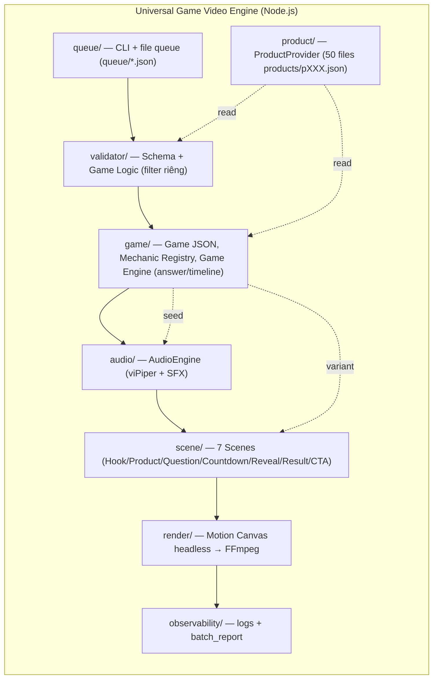
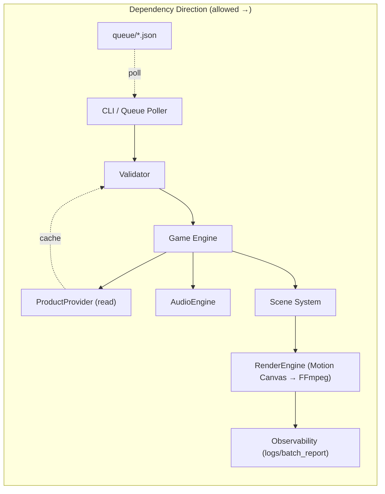
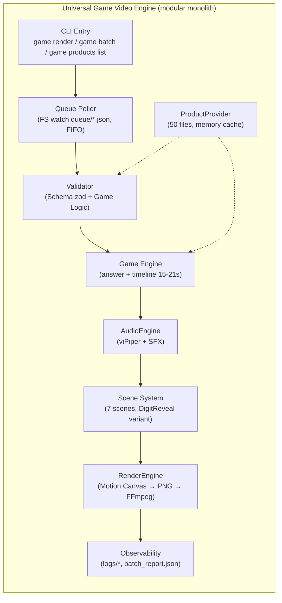

# Architecture Spine — Universal AI Game Video Engine

## Design Paradigm

**Modular Monolith — Bounded Contexts**

Hệ thống là một monolith TypeScript chạy local, chia thành 6 bounded contexts gọi nhau qua interface nội bộ (không qua HTTP/RPC). Mỗi context sở hữu data + logic riêng, không share mutable state.



**Lý do:** Factory 15s với 7 scenes không cần pipes-and-filters 5 stages rời rạc như drawing cũ — modular monolith giữ Scene reuse (6/7 giống nhau) rõ ràng, dễ test từng context, và Hermes chỉ cần ghi `queue/*.json` mà không cần deploy microservices.

---

## Invariants & Rules

### AD-1 — Paradigm: modular monolith, bounded contexts `[ADOPTED]`

- **Binds:** all FRs, NFR-1, NFR-5
- **Prevents:** Microservices overhead cho 50-100 video/ngày; Scene logic rải rác, không reuse được
- **Rule:** Code chia thành `src/game/`, `src/product/`, `src/validator/`, `src/scene/`, `src/audio/`, `src/render/`, `src/queue/`, `src/observability/`. Context chỉ depend theo hướng `queue → validator → game → audio/scene → render → observability`. Không circular dep. Shared kernel chỉ có `types/` (Game JSON, Seed) và `utils/seedrandom`.

### AD-2 — Language & runtime: TypeScript trên Node.js `[ADOPTED]`

- **Binds:** all
- **Prevents:** Polyglot drift
- **Rule:** Toàn bộ app code TypeScript, Node.js ≥22 LTS. External binaries (FFmpeg, Piper) gọi qua `child_process.spawn` với typed wrapper. Không Python.

### AD-3 — Validator là filter riêng, chặn trước Engine `[ADOPTED]`

- **Binds:** FR-1, FR-3, FR-4, FR-6, FR-7, FR-8, NFR-1
- **Prevents:** Engine tính answer trên JSON hỏng → video sai; LLM hallucinate price lọt vào render
- **Rule:** `Validator.validate(gameJson): Result<void, ValidationError>` chạy 2 tầng: (1) Schema (zod) — `scenes ⊆ 7 MVP`, `totalDuration 15–21s`; (2) Game Logic — `answer` tồn tại & khớp `entities`, `choices` không trùng, `price` phải resolve từ ProductProvider. Fail → return error `E_*`, **không gọi Engine**. Validator không mutate JSON — chỉ read.

### AD-4 — Ownership: price = ProductProvider, affiliate_link = publishing warning

- **Binds:** FR-2, FR-10, NFR-1
- **Prevents:** LLM bịa giá lọt vào video; Hermes đăng video thiếu link mất commission mà không biết
- **Rule:** `price` và `affiliate_link` trong Game JSON final **phải** bằng `ProductProvider.get(productId)` tại `updatedAt`. Validator: `price` mismatch → `E_PRICE_SOURCE_INVALID` (hard fail, block render); `affiliate_link` missing/invalid → `W_AFFILIATE_MISSING` (warning, vẫn render MP4, log để Hermes biết). Link **chỉ** xuất trong `caption.json` / comment, không burn vào MP4.

### AD-5 — ProductProvider: 50 files `products/pXXX.json` `[ADOPTED]`

- **Binds:** FR-2, NFR-1
- **Prevents:** Single `products.json` bị corrupt khi Hermes update 1 SKU giữa batch; reload toàn bộ 50 SKU chậm
- **Rule:** Mỗi SKU là `products/p001.json` với schema zod `{productId, name, image, price, currency, source, updatedAt, category, brand, affiliate_link}`. Provider load toàn bộ vào memory cache at startup (≤200ms), watch FS để reload file thay đổi. Write phải atomic: `p001.tmp.json → validate zod → rename → p001.json`. `image` phải tồn tại `assets/pXXX.webp`, thiếu → `E_ASSET_MISSING`.

### AD-6 — Scene System: 7 scenes, interface variant, DigitReveal riêng

- **Binds:** FR-5, FR-6, FR-7, FR-8
- **Prevents:** 20 mechanic tạo 20 Scene rẽ nhánh, không reuse; ONE_AWAY digit flip bị ép vào PriceReveal
- **Rule:** Mỗi Scene implement `IScene { render(ctx: SceneContext): Promise<Frame[]> }` với `SceneContext { game, timeline, variant }`. 6 scenes (`Hook, Product, Question, Countdown, Result, CTA`) giống hệt giữa 3 mechanics. `RevealScene` có 2 impl: `PriceReveal` (HI_LO, MOST_EXPENSIVE) và `DigitReveal` (ONE_AWAY, `?` → digit flip). `ResultScene` nhận `variant: in_video|comment` — `in_video` hiện answer, `comment` hiện "Đáp án ở comment 👇".

### AD-7 — AudioEngine: adapter, viPiper offline, sync ±0.1s

- **Binds:** FR-9, NFR-2, NFR-5
- **Prevents:** Hard-code TTS, không swap được khi cần clone voice Phase 2
- **Rule:** `IAudioEngine { synthesizeVoice(script: string, opts): Promise<AudioSegment> }` — MVP impl `ViPiperEngine` (MIT, offline, <2s). SFX local `assets/sfx/*.wav` (countdown tick mỗi 0.5s, reveal, correct/wrong). Voice phải khớp `RevealScene` ±0.1s; music `tension_01` volume 0.18 không lấn voice. `[ASSUMPTION]` viPiper đủ tự nhiên cho quiz — verify R0 blind test.

### AD-8 — Rendering: Motion Canvas headless → PNG seq → FFmpeg `[ADOPTED]`

- **Binds:** FR-10, NFR-3, NFR-5
- **Prevents:** Remotion license risk; AI video hallucinate text/timer; browser GUI dep
- **Rule:** `RenderEngine` dùng Motion Canvas headless API render 1080×1920 30fps thành PNG sequence, sau đó `FFmpegEngine` mux `frames + voice.wav + SFX + music → MP4 (libx264 -crf 18 -preset fast, AAC)`. Không burn `affiliate_link` vào video.

### AD-9 — Queue: file-based `queue/*.json`, CLI headless `[ADOPTED]`

- **Binds:** FR-11, NFR-4
- **Prevents:** DB dependency (Redis/SQLite) cho 50-100 job/ngày; Hermes phải đợi HTTP API
- **Rule:** `game render --mechanic hi_lo --products p001,p042 --seed 123` → tạo `queue/job_<uuid>.json` `{jobId, gameId, mechanic, productIds, seed, result_variant, status: pending|running|done|failed, retries}`. `game batch --count 50 --mechanics hi_lo,most_expensive,one_away` enqueue 50 jobs. Engine poll `queue/` (FS watch), dequeue FIFO. Hermes chỉ cần quyền ghi `queue/` và đọc `export/` + `logs/`. Không SQLite ở MVP.

### AD-10 — Batch: bounded pool + fail-forward + seed determinism

- **Binds:** FR-11, NFR-3, NFR-4, NFR-1, NFR-2
- **Prevents:** RAM overflow (>4GB) khi batch 50; 1 job fail abort cả batch; non-reproducible video khi debug
- **Rule:**
  - **Pool:** `WORKER_POOL_MAX = Math.min(os.cpus().length - 1, 3)` — giới hạn cứng 3 workers đến khi benchmark R0. Mỗi worker chạy 1 job tại một thời điểm.
  - **Fail-forward:** Job fail (Validator/LLM/timeout) → log `logs/<gameId>.json` `{code, filter, cause}`, mark `status: failed`, tiếp tục job kế tiếp. Cuối batch ghi `batch_report.json {total, passed, failed, avg_render_ms, jobs[]}` và `manual_interventions == 0` cho SM-3.
  - **Determinism:** Mọi random (diversification: màu, tilt ±2°, BGM pick; retry jitter) phải qua `seedrandom(seed)`, **cấm** `Math.random()`. Cùng `Game JSON + seed` → cùng `answer` + `timeline` ±0.05s (pixel có thể khác do anti-aliasing).
  - **Timeouts:** `Piper TTS: (text.length/10+2)s`, `FFmpeg: frameCount*200ms (max 120s)`, `Motion Canvas: 90s` — timeout → `SIGKILL`, `Result.err(PROCESS_TIMEOUT)`, worker giải phóng.
  - **Temp & health:** Mỗi job dùng `temp/<jobId>/`, cleanup trong `finally`; pre-flight check disk ≥2GB trước batch, nếu thiếu → abort `INSUFFICIENT_DISK_SPACE`.



---

## Consistency Conventions

| Concern | Convention |
|---|---|
| **Naming (entities)** | PascalCase types (`GameJson`, `Product`, `SceneContext`), camelCase vars, kebab-case files (`product-provider.ts`), SKU IDs `p001` lowercase |
| **Naming (mechanics)** | Enum `Mechanic = 'HI_LO' \| 'MOST_EXPENSIVE' \| 'ONE_AWAY'` upper_snake; `Interaction = 'BOOLEAN' \| 'MULTIPLE_CHOICE' \| 'DIGIT'` |
| **Data & formats** | IDs: `nanoid` 12-char for jobId; `productId` `pXXX`; Dates ISO 8601 UTC; Durations ms int; Prices int VND; Currency `"VND"` |
| **Error shapes** | `AppError { code: string, field?: string, hint?: string, cause?: Error }` Codes: `E_SCHEMA_*`, `E_GAME_LOGIC_*`, `E_PRICE_SOURCE_INVALID`, `W_AFFILIATE_MISSING`, `E_ASSET_MISSING`, `E_HILO_EQUAL_PRICE`, `PROCESS_TIMEOUT`, `INSUFFICIENT_DISK_SPACE` |
| **Config** | Single `config.json` at root; Hierarchy: CLI flag > Game JSON field > config.json > default. No env var drift |
| **Logging** | Structured JSON via `pino`; each job logs `{ jobId, gameId, mechanic, durationMs, status, validatorErrors[] }` to `logs/<gameId>.json`; batch summary to `export/batch-<ts>/batch_report.json` |
| **File output** | `export/<gameId>_<seed>.mp4` + `caption.json {caption, hashtags, affiliate_link}` + `timeline.json`; `queue/job_*.json`; `products/pXXX.json`; `assets/pXXX.webp` |
| **Validation** | zod schemas for Game JSON, Product, Queue Job; Validator returns `Result<void, ValidationError[]>` with `code/field/hint` |

---

## Stack

| Name | Version | Note |
|---|---|---|
| Node.js | ≥22 LTS | Runtime |
| TypeScript | ≥5.6 | Language |
| Motion Canvas | latest (MIT) | Headless render 1080×1920 30fps — verify R0 headless |
| viPiper / Piper | rhasspy/piper v2023.11.14-2 archived MIT (`vi_VN-vais1000-medium`) | Offline TTS — swap via `IAudioEngine` if quality fails |
| FFmpeg | ≥7.x (LGPL) | H.264/AAC mux (`libx264 -crf 18 -preset fast`) |
| zod | latest | Schema validation (Game, Product, Job) |
| seedrandom | latest | Seeded PRNG — bans Math.random() |
| pino | latest | Structured logging |
| nanoid | latest | jobId |
| sharp | latest (optional) | Image resize/verify `assets/pXXX.webp` |
| openai / @google/generative-ai | latest | LLM JSON mode (hook/question/cta only, never price) — retry 3× |

---

## Structural Seed



```text
root/
  src/
    game/          # Game JSON types, Mechanic registry (HI_LO/MOST_EXPENSIVE/ONE_AWAY), GameEngine (answer/timeline)
    product/       # ProductProvider (products/pXXX.json, zod, atomic write, FS watch)
    validator/     # SchemaValidator + GameLogicValidator, error codes
    scene/         # IScene, 7 scenes: Hook/Product/Question/Countdown/Reveal(Price/Digit)/Result/CTA
    audio/         # IAudioEngine (ViPiperEngine), SFX resolver, sync
    render/        # Motion Canvas headless, FFmpeg mux
    queue/         # CLI, job JSON, poller, worker pool (min(CPU-1,3)), fail-forward
    observability/ # logs, batch_report, healthCheck
    types/         # GameJson, Product, Job, Seed
    utils/         # seedrandom wrapper, result type, pino logger
  products/        # p001.json ... p050.json (50 SKU mock)
  assets/
    pXXX.webp      # product images
    sfx/           # countdown tick, reveal, correct/wrong
    music/         # tension_01
  queue/           # job_*.json (file queue)
  export/          # <gameId>_<seed>.mp4 + caption.json
  logs/            # <gameId>.json
  temp/            # <jobId>/ (PNG seq, auto-cleanup)
  config.json
```

---

## Capability → Architecture Map

| Capability / Area | Lives in | Governed by |
|---|---|---|
| Universal Game JSON (FR-1) | `src/game/`, `src/types/` | AD-1, AD-3, zod |
| Mock Product DB 50 SKU (FR-2) | `src/product/` (50 files) | AD-5, AD-4 |
| Two-Layer Validator (FR-3) | `src/validator/` | AD-3, AD-4 |
| Deterministic Answer/Timeline (FR-4) | `src/game/` | AD-10 (determinism), AD-3 |
| 7 Reusable Scenes (FR-5) | `src/scene/` | AD-6 |
| HI_LO BOOLEAN (FR-6) | `src/game/mechanics/hiLo.ts` + `src/scene/` | AD-1, AD-6 |
| MOST_EXPENSIVE MULTIPLE_CHOICE (FR-7) | `src/game/mechanics/mostExpensive.ts` | AD-1, AD-6 |
| ONE_AWAY DIGIT (FR-8) | `src/game/mechanics/oneAway.ts` + `DigitReveal` | AD-6 (variant) |
| AudioEngine viPiper+SFX (FR-9) | `src/audio/` | AD-7 |
| Local Render 1080×1920 (FR-10) | `src/render/` | AD-8, AD-10 |
| CLI + File Queue headless (FR-11) | `src/queue/` | AD-9, AD-10 |
| Cost Local-first (NFR-2) | `src/audio/`, `src/render/` | AD-7, AD-8 |
| Performance ≤45s/4GB (NFR-3) | `src/queue/`, `src/render/` | AD-10 |
| Observability for Hermes (NFR-4) | `src/observability/` | AD-10 |
| MIT Licensing (NFR-5) | Stack | AD-2, AD-7, AD-8 |

---

## Deferred

| Decision | Why defer |
|---|---|
| Voice cloning (MC Trần Ngọc) | MVP uses free viPiper; cloning needs sample + license + fine-tune — defer to Phase 2 via `IAudioEngine` swap |
| HTTP API (`POST /render`) | File queue sufficient for 50-100/day; API adds deploy/auth overhead — defer until Hermes needs >100/day or remote call |
| SQLite for queue/products | 50 files + FS watch enough; DB adds ops — defer until batch >200 or concurrent writers |
| CHECK_OUT + 16 mechanics | MVP proves 3 Interaction families; remaining mechanics reuse same Scene/Game pattern — defer to Phase 2 |
| Hermes crawl + auto-post | Hermes is stub in MVP (Trung presses `game batch`); full crawl/comment AI needs TikTok/Shopee API research — Phase 2 |
| Diversification strength vs TikTok dedup | Need 20-video A/B test (OQ-2) — defer tuning `tilt/color/BGM` params |
| Motion Canvas vs Remotion fallback | Keep Motion Canvas MIT; only fallback to Remotion if headless verify fails R0 — decision after spike |

---

*Supersedes: `architecture-auto-drawing-2026-09-05` (pipes-and-filters drawing factory) — retained at `_bmad-output/planning-artifacts/architecture/architecture-auto-drawing-2026-09-05/` for reference. New spine governs Universal Game Video Engine only.*
