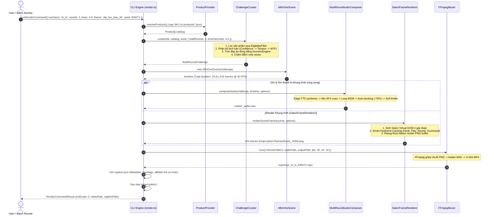

# Kiến trúc Hệ thống (System Architecture)

Tài liệu kỹ thuật chuyên sâu mô tả kiến trúc, nguyên lý thiết kế, các bounded contexts, hợp đồng dữ liệu (data contracts) và pipeline xử lý của **auto-drawing (Universal AI Game Video Engine)**.

---

## 1. Triết lý Thiết kế (Design Principles)

Hệ thống được xây dựng theo mô hình **Modular Monolith** kết hợp nguyên lý **Clean Architecture** và **Domain-Driven Design (DDD)** với các tiêu chuẩn:

1. **Local-First & Zero External SaaS Cost**:
   - Vận hành 100% trên phần cứng máy trạm hoặc VPS thông thường.
   - Không phụ thuộc vào các API render video đám mây trả phí đắt đỏ (Replicate, Shotstack, Creatomate...). Chi phí kết xuất ~0 VNĐ/video.
2. **Determinism (Tính Tất định)**:
   - Cùng một bộ `(seed, dsl, catalog, options)` sẽ luôn luôn sinh ra video có nội dung, câu hỏi, giọng đọc và hình ảnh chính xác từng frame và từng mẫu âm thanh (bit-for-bit/frame-perfect).
3. **Strict Data Integrity ("Zero Data Invention")**:
   - Renderer và Presentation layer hoạt động theo nguyên tắc pure projection (chiếu dữ liệu).
   - Tuyệt đối không tự suy diễn giá tiền, không tự đoán đáp án, không dùng giá fallback ngẫu nhiên trong renderer. Mọi logic xác định thắng/thua và giá sản phẩm thuộc về `ChallengeCurator` và `Validator`.
4. **Platform Safe Zone Compliance (TikTok/Reels/Shorts)**:
   - Mọi phần tử UI, thẻ sản phẩm, câu hỏi và nút tương tác bắt buộc phải nằm trọn trong vùng an toàn `y: 360px – 1580px` của khung hình dọc 1080×1920.

---

## 2. Bounded Contexts & Quy tắc Ràng buộc Phụ thuộc

Dự án áp dụng quy tắc phụ thuộc 1 chiều nghiêm ngặt (được kiểm tra tự động bởi ESLint rule `import/no-restricted-paths`):

```
┌───────────────────────────────────────────────────────────┐
│                      CLI & Studio                         │
└─────────────────────────────┬─────────────────────────────┘
                              │
┌─────────────────────────────▼─────────────────────────────┐
│                   Queue & Orchestrator                    │
└─────────────────────────────┬─────────────────────────────┘
                              │
┌─────────────────────────────▼─────────────────────────────┐
│             Validator & Product Catalog                   │
└─────────────────────────────┬─────────────────────────────┘
                              │
┌─────────────────────────────▼─────────────────────────────┐
│            Challenge Engine & Game Definitions            │
└──────────────────────┬──────────────┬─────────────────────┘
                       │              │
        ┌──────────────▼─────┐  ┌─────▼──────────────┐
        │   Scene & Timeline │  │    Audio Engine    │
        └──────────────┬─────┘  └─────┬──────────────┘
                       │              │
                       └───────┬──────┘
                               │
                ┌──────────────▼─────────────┐
                │       Render Engine        │
                │ (ScenePainter, AssetCache) │
                └──────────────┬─────────────┘
                               │
                ┌──────────────▼─────────────┐
                │   FFmpeg Muxer & Output    │
                └────────────────────────────┘
```

### Các Bounded Contexts chính:

| Bounded Context | Trách nhiệm cốt lõi | Các Modules tiêu biểu |
| :--- | :--- | :--- |
| **`product`** | Quản lý kho SKU, nạp metadata JSON, cache in-memory, schema validation. | `ProductProvider`, `schema.ts` |
| **`validator`** | Kiểm định toàn vẹn kịch bản 2 tầng (Schema Zod + Invariant Logic rules). | `Validator.ts`, `errors.ts` |
| **`challenge`** | Dynamic Multi-Round Engine: phân bổ độ khó, tính toán câu hỏi, sinh đáp án, chấm điểm viral vector. | `ChallengeCurator.ts`, `DecisionEngine.ts`, `KnapsackEngine.ts`, `NumericEngine.ts`, `ViralScorer.ts` |
| **`definitions`** | Khai báo Game DSL (7 mechanics: g1, g2, g3, g5, g7, g9, g41) quy định layout, thời gian, số SKU. | `g1_hi_lo.ts`, `g41_deal_or_scam.ts`... |
| **`scene`** | Xây dựng trục thời gian (Timeline slots: Hook, Play, Reveal, MicroHook, Scorecard). | `AllInOneScene.ts`, `Timeline.ts` |
| **`audio`** | Tổng hợp âm thanh đa tầng: Edge TTS tiếng Việt, SFX đếm ngược/reveal, auto-ducking nhạc nền. | `EdgeTtsEngine.ts`, `MultiRoundAudioComposer.ts` |
| **`render`** | Kết xuất đồ hoạ 1080×1920: Satori SVG/Resvg native với keyframe caching (mặc định), Software Canvas fallback, cache ảnh in-memory, quản lý VisualTheme (5 UI templates sáng), muxing MP4 H.264. | `satoriFrameRenderer.ts`, `softwareFrameRenderer.ts`, `scenePainter.ts`, `RenderAssetCache.ts`, `themes.ts`, `ffmpeg.ts` |
| **`queue`** | Quản lý hàng đợi job file-based không cần Redis/RabbitMQ. | `QueueStore.ts`, `QueueJob.ts` |
| **`observability`** | Logging chuẩn JSON Lines, đo lường thời gian từng stage, xuất báo cáo batch. | `BatchReporter.ts`, `timing.ts` |
| **`studio`** | Giao diện Next.js 15 Web Studio trực quan, xem trước HTML, live stream SSE render. | `studio/src/app/api/*` |

---

## 3. Sơ đồ Tuần tự Pipeline (Sequence Diagram)

Quy trình sản xuất 1 video Multi-Round hoàn chỉnh từ lệnh CLI/Studio:



---

## 4. Các Hợp đồng Dữ liệu Cốt lõi (Data Contracts)

### 4.1. `MultiRoundChallenge` & `ChallengeRound` (`src/challenge/types.ts`)
Đây là output chuẩn từ Bounded Context `challenge`, được Scene và Audio consume:

```typescript
export interface MultiRoundChallenge {
  gameId: string;            // Ví dụ: "g1_hi_lo", "g9_guess_the_price"
  seed: number;              // Seed tất định
  title: string;             // Tiêu đề game
  seriesNumber: number;      // Số tập trong chuỗi nội dung
  rounds: ChallengeRound[];  // Danh sách các vòng chơi
  finalCta: string;          // Lời kêu gọi hành động cuối video
}

export interface ChallengeRound {
  roundIndex: number;                         // 1, 2, 3...
  type: 'confidence_builder' | 'tension_creator' | 'wtf_reveal';
  mechanic?: string;                          // "hi_lo", "deal_or_scam"...
  question: string;                           // "Món B CAO HƠN hay THẤP HƠN món A?"
  hookText?: string;
  microHook?: string;
  products: Product[];                        // 1..4 sản phẩm xuất hiện trong vòng
  choices: ChallengeChoice[];                 // Các phương án lựa chọn
  correctAnswer: string | number;             // Mã hoặc giá trị đáp án chính xác
  timerSeconds: number;                       // Thời gian đếm ngược (>= 1.0s, linh hoạt N rounds x M seconds)
  scoreVector: ChallengeScoreVector;          // Vector tâm lý viral 10 chiều
  revealText: string;                         // Chuỗi công bố khi lật mở đáp án
}

export interface ChallengeChoice {
  id: string;                                 // "A", "B", "higher", "lower", "deal"...
  label: string;                              // "CAO HƠN", "THẤP HƠN", "189K"...
  isCorrect: boolean;                         // Đánh dấu lựa chọn đúng
  value?: number | string;                    // Giá trị thực tế gắn kèm
}
```

### 4.2. `Product` Schema (`src/product/schema.ts`)
```typescript
export interface Product {
  productId: string;        // Regex: /^p\d+$/ (ví dụ: "p001")
  name: string;             // Tên hiển thị sản phẩm
  image: string;            // Đường dẫn tương đối (assets/images/p001.png)
  price: number;            // Giá bán niêm yết chính thức (số nguyên dương)
  currency: string;         // Mặc định: "VND"
  source: string;           // Nguồn dữ liệu ("mock", "shopee", "tiktok_shop")
  updatedAt: string;        // ISO 8601
  category: string;         // Ngành hàng: "gia dụng", "công nghệ"...
  brand: string;            // Thương hiệu: "OMO", "Sony"...
  affiliate_link: string;   // Link tiếp thị liên kết (Bảo vệ bởi PixelScan)
  
  // Các trường tuỳ chọn hỗ trợ thuật toán viral
  sizeCategory?: 'tiny' | 'small' | 'medium' | 'large' | 'bulky';
  perceivedValue?: 'dirt_cheap' | 'budget' | 'mid_range' | 'premium' | 'luxury';
  originalPrice?: number;
  discountPercent?: number;
}
```

### 4.3. `RenderAssetCache` (`src/render/assetCache.ts`)
Bộ đệm in-memory giải quyết nghẽn cổ chai disk I/O khi decode ảnh PNG qua hàng trăm frame:

```typescript
export class RenderAssetCache {
  private cache = new Map<string, Image>();

  // Nạp hoặc lấy ảnh từ RAM, tự động resolve đường dẫn tuyệt đối
  getImage(imagePath: string, rootDir?: string): Image | null;
  
  // Kiểm tra ảnh đã được cache hay chưa
  has(imagePath: string, rootDir?: string): boolean;
  
  // Xóa cache sau khi render xong job
  clear(): void;
  
  // Số lượng ảnh hiện tại trong cache
  get size(): number;
}
```

---

## 5. Timeline & Scene System (`src/scene/AllInOneScene.ts`)

Mỗi video Multi-Round được chia thành một chuỗi các `TimelineSlot` liên tục không có khoảng chết (Zero Dead Air) và dựng trực tiếp qua Satori Virtual DOM:

```
┌──────────┬──────────────────────┬──────────────────────┬─────────────┬───────────┐
│ Hook     │ Round 1              │ Round 2              │ Round N     │ Scorecard │
│ (~2.0s)  │ Play: M.s | Rev: 2s  │ Play: M.s | Rev: 2s  │ ...         │ & CTA 2.5s│
└──────────┴──────────────────────┴──────────────────────┴─────────────┴───────────┘
```

1. **Supermarket Hook (0.0s – ~2.0s)**: Xuất hiện biển hiệu siêu thị Pop-Art, banner nổ *"THỬ THÁCH GIỜ VÀNG"*, khung xem trước sản phẩm vòng 1 và nút *"BẮT ĐẦU CHƠI NGAY"*.
2. **Các Round Chơi (Rounds 1..N)**:
   - **Play Phase (`round.timerSeconds`, hỗ trợ linh hoạt từ 1.0s trở lên: 3.0s, 4.0s, 5.0s...)**:
     - Huy hiệu "CÂU X/N" và tiêu đề thử thách xuất hiện tức thì.
     - Khung thẻ sản phẩm phóng to tối đa an toàn (Safe Zone), ảnh sắc nét, giá ẩn bằng sticker Pop-Art.
     - Bảng đồng hồ LED kỹ thuật số đếm ngược thời gian thực (`⏰ CÒN M.m GIÂY`).
     - Giọng đọc AI cất lên đồng bộ với âm thanh SFX tick đếm ngược dồn dập.
   - **Reveal Phase (~2.0s)**:
     - Lật mở giá niêm yết thật trên thẻ sản phẩm.
     - Highlight viền vàng và nhãn WINNER cho đáp án chính xác.
     - Đồng hồ LED đổi sang trạng thái `✔ CHỐT! ĐÃ LỘ DIỆN ĐÁP ÁN!`.
     - Banner xanh giải thích kết quả chi tiết kèm âm thanh chuông reo/kèn chiến thắng.
3. **Scorecard & CTA (~2.5s)**:
   - Biển tổng kết thử thách siêu thị với 3 ngôi sao vàng vector SVG.
   - Thống kê tỷ số từng câu hỏi với icon tích xanh vector.
   - Nút kêu gọi hành động (CTA): *"BÌNH LUẬN ĐIỂM SỐ CỦA BẠN!"*.

---

## 6. Kiến trúc Âm thanh Đa tầng (`MultiRoundAudioComposer.ts`)

Video viral đòi hỏi trải nghiệm âm thanh sống động và phân tầng rõ ràng:

1. **Voice Track (Edge Neural TTS)**:
   - Kịch bản câu hỏi được gửi tới Microsoft Azure Edge TTS WebSocket API.
   - Giải mã luồng MP3 trả về thành WAV PCM Mono 24kHz.
   - Tự động áp dụng bộ lọc `atempo` để co giãn tốc độ đọc vừa khớp với thời gian đếm ngược của round.
2. **SFX Track (Sound Effects)**:
   - Cues âm thanh đếm ngược kích hoạt với chuỗi âm lượng leo thang:
     `COUNTDOWN_GAINS = [0.30, 0.35, 0.42, 0.50, 0.62, 0.75, 0.90]`
   - Tạo áp lực tâm lý thôi thúc người xem bình luận trước khi hết giờ.
3. **Music Track & Auto-Ducking**:
   - Nhạc nền căng thẳng (Tension BGM) được phát lặp liên tục.
   - Khi có giọng đọc AI cất lên, hệ thống tự động giảm âm lượng nhạc nền xuống **25%** (`floor = 0.25`) với tốc độ dốc vào `attackSec = 0.08s` và nhả ra `releaseSec = 0.20s`.
4. **Soft Limiter & Normalization**:
   - Bộ giới hạn mềm quét toàn bộ biên độ master buffer để triệt tiêu hiện tượng clipping (vỡ tiếng) khi giọng đọc, SFX và nhạc nền va chạm tại các điểm cao trào.

---

## 7. Động cơ Đồ hoạ & Bố cục 9:16 (`src/render/`)

Hệ thống cung cấp cơ chế kết xuất khung hình pluggable (`IFrameRenderer`) tối ưu hoá cho hiệu năng và độ ổn định cao:

### 7.1. Kiến trúc Bộ Kết xuất Khung hình (Frame Renderers)

1. **Satori Frame Renderer (`satoriFrameRenderer.ts` — Mặc định / Primary)**:
   - **Cơ chế**: Sinh Virtual DOM kịch bản `1080×1920` $\rightarrow$ Satori biên dịch sang SVG $\rightarrow$ Rust native engine (`@resvg/resvg-js`) rasterize sang buffer PNG.
   - **Smart Keyframe Caching**: Trong video 18s (540 frames), hầu hết các phân cảnh (Hook, Question, Reveal, Scorecard) đều là đồ hoạ tĩnh. Hệ thống tự động nhận diện trạng thái và lưu bộ đệm frame PNG đã render. Chỉ khi đến phân cảnh đếm ngược (Countdown tick/ring animation), Satori mới tính toán lại SVG.
   - **Hiệu quả**: Giảm số lần sinh SVG từ 540 lần xuống còn ~35 lần, giúp tốc độ render video 18s chỉ mất **dưới 20 giây** với mức tiêu thụ RAM cực thấp (~17MB heap).
2. **Software Frame Renderer (`softwareFrameRenderer.ts` — Fallback)**:
   - **Cơ chế**: Bộ rasterizer 2D Canvas thuần TypeScript/JavaScript (không cần font hệ thống hay native binary).
   - Sử dụng cơ chế mẫu keyframe phân đoạn để đảm bảo tính tất định (deterministic) 100% trên mọi nền tảng.
3. **Zero Browser Overhead**:
   - Dự án **loại bỏ hoàn toàn Puppeteer / Headless Chromium** ra khỏi kiến trúc render video.
   - Tiết kiệm hơn 500MB RAM, loại bỏ hoàn toàn độ trễ giao tiếp CDP qua WebSocket, không lo lỗi crash trình duyệt ngầm khi chạy batch hàng loạt.

### 7.2. Tiêu chuẩn Safe Zone 9:16 & Giới Hạn Tối Đa An Toàn (Maximum Safe Limits)
Khung hình di động TikTok/Shorts có độ phân giải **1080 × 1920**. Các vùng nguy hiểm bị che bởi UI của nền tảng:
- `y < 360px`: Thanh tìm kiếm, nút chuyển tab (Following/For You), tên camera filter.
- `y > 1580px`: Caption văn bản, hashtags, audio marquee quay tròn, nút Home/Shop.
- `x > 920px`: Cột nút tương tác (Avatar chủ kênh, Tim, Bình luận, Bookmark, Share).

**Quy chuẩn bố cục & Giới hạn kích thước thẻ (Max Safe Limits):**
- **HUD Series**: `y = 120px` (nằm gọn phía trên cùng).
- **Question Box**: `y = 220px` (bắt đầu vùng an toàn).
- **Product Showcase Area**: `y = 440px – 1180px` (vùng trung tâm thị giác mạnh nhất).
  - **Game 2 Thẻ (`hi_lo`)**: Ảnh sản phẩm phóng to lên **`260×260px`** (+87% diện tích ảnh), chiều cao thẻ **`325px`**.
  - **Game 3 Thẻ (`most_expensive`, `grocery_basket`)**: Ảnh sản phẩm **`220×220px`** (+34% diện tích ảnh), chiều cao thẻ **`255px`**, khoảng cách giữa các thẻ 18px. Đáy thẻ thứ 3 dừng tại **`y ≈ 1101px`**, an toàn tuyệt đối trước vạch giới hạn **`y = 1200px`** của banner reveal.
  - **Game 1 Thẻ (`one_away`, `deal_or_scam`, `guess_the_price`)**: Ảnh sản phẩm **`430×430px`** (+28% diện tích ảnh), chiều rộng thẻ **`940px`**, viền Pop-Art 6px nổi khối.
- **Choice Deck Buttons**: Bố trí tương tác ngay dưới khu vực sản phẩm.
- **Countdown LED / Status Banner**: Bảng LED kỹ thuật số `⏰ CÒN M.m GIÂY` hoặc `✔ CHỐT! ĐÃ LỘ DIỆN ĐÁP ÁN!` nằm an toàn trên mốc `y = 1480px`.

### 7.3. Hỗ trợ Layout Sản phẩm Đa dạng
- **1 Sản phẩm** (`deal_or_scam`, `one_away`, `guess_the_price`): Thẻ sản phẩm lớn chính giữa `940px`, ảnh `430×430px`, sticker Pop-Art ấn tượng.
- **2 Sản phẩm** (`hi_lo`): 2 thẻ đối xứng xếp dọc với ảnh `260×260px`, nhãn "MÓN A" (Mốc so sánh) và "MÓN B" (Cần đoán).
- **3 Sản phẩm** (`grocery_basket`, `most_expensive`): Layout 3 tầng với ảnh `220×220px`, thẻ `255px`, căn lề chuẩn xác trước banner reveal.
- **4 Sản phẩm** (`odd_one_out`): Lưới 2×2 trực quan (A, B, C, D) với nhãn phân định rõ ràng.

### 7.4. Hệ thống Mẫu Giao diện Đồ Họa (Visual Theme Engine)

Hệ thống theme được tách lớp độc lập khỏi logic bài toán (`challenge`) và timeline (`scene`), cho phép thay đổi toàn bộ diện mạo video mà không làm thay đổi câu hỏi, đáp án hay luồng âm thanh:

1. **Flagship Pop-Art Supermarket Theme (`dai_hoi_sieu_thi` — Mặc định CLI)**:
   - **Phong cách Pop-Art Truyện Tranh**: Nền vàng chanh rực rỡ `#fef08a`, viền đen đậm 4-6px `#0f172a`, sticker nổ góc thẻ và bảng LED kỹ thuật số.
   - **100% Vector SVG Icons**: Sử dụng vector SVG thuần cho toàn bộ icon (sao vàng, đồng hồ, dấu tích, xe đẩy, tia chớp) thay cho Unicode emoji, loại trừ 100% rủi ro thiếu glyph (tofu `[ ]`) trên Windows.
   - **4 Giai Đoạn Hoàn Chỉnh**: Tích hợp chặt chẽ Hook (biển hiệu siêu thị), Play (đếm ngược LED), Reveal (lật mở giá), Scorecard (3 sao vàng, bảng recap).
2. **Bộ UI Templates Sân Khấu Homemaker**:
   - `hay_chon_gia_dung`: Sân khấu gameshow Hãy Chọn Giá Đúng (Xanh dương hoàng gia - Vàng gold kim loại, spotlight).
   - `sieu_thi_gia_dinh`: Bách Hóa & Siêu Thị Gia Đình (Nền xanh lá tươi mát, thẻ viền đỏ nổi bật, thân thuộc và tin cậy).
   - `bep_am_noi_tro`: Gian Bếp Ấm Cúng & Nội Trợ (Tông cam kem ấm áp pastel, bo góc 32px mềm mại).
   - `gio_vang_san_deal`: Đại Hội Giờ Vàng Săn Deal (Đỏ cam rực lửa, đèn spotlight, kích thích mua sắm).
   - `tap_hoa_vui_ve`: Tiệm Tạp Hóa Bình Dân (Nền vàng chanh rực rỡ phối viền xanh ngọc teal, vui nhộn và bình dân).
3. **Cơ chế Phân giải & Fallback An toàn (`resolveTheme`)**:
   - Tự động nhận diện chuỗi định danh theme (string ID) hoặc object `VisualTheme` tùy biến.
   - Fallback an toàn về `dai_hoi_sieu_thi` nếu không tìm thấy theme chỉ định.
4. **Tích hợp Native Satori Virtual DOM**:
   - Các thuộc tính gradient nền, spotlight radial mask, viền thẻ, shadow và countdown SVG ring được liên kết trực tiếp vào Virtual DOM của Satori, cho phép render SVG siêu tốc đạt 30 FPS với zero runtime layout shifts.

---

## 8. Cơ chế Bảo mật Dữ liệu & Tiếp thị Liên kết (Affiliate Safety)

Hệ thống được thiết kế để tuân thủ 100% chính sách cộng đồng của TikTok Shop, Shopee và Meta:

1. **Không in Link Affiliate lên Khung hình Video (Zero Burned-in Links)**:
   - Các nền tảng video ngắn sẽ bóp tương tác hoặc cấm đăng nếu phát hiện video có chứa URL thô hoặc mã QR chuyển hướng ngoài sàn.
   - Mô-đun `pixelScan.ts` sẽ phân tích buffer trước khi xuất video để đảm bảo không có chuỗi URL nào xuất hiện trong khung hình.
2. **Xuất Kèm File Caption Tiêu Chuẩn (`*.caption.json`)**:
   - Mọi thông tin tiếp thị, link affiliate ngắn gọn, mã voucher, và hashtags đều được xuất vào file JSON kèm theo để tự động đưa vào mục bình luận (Comment ghim) hoặc phần mô tả video.
