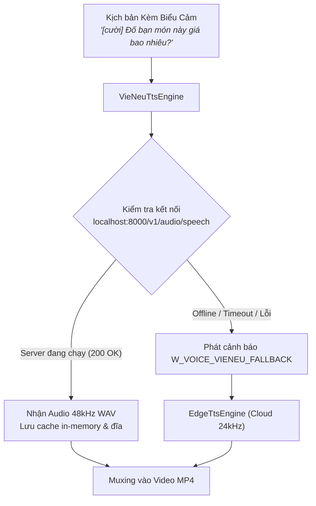

# Đặc Tả Kỹ Thuật: Tích Hợp VieNeu-TTS (48kHz AI Voice Engine)

Tài liệu này lưu trữ toàn bộ nghiên cứu khả thi, thiết kế kiến trúc, cấu hình phần cứng và lộ trình tích hợp mô hình TTS tiếng Việt **[VieNeu-TTS](https://github.com/pnnbao97/VieNeu-TTS)** vào hệ thống `auto-drawing`.

---

## 1. Bối Cảnh & Mục Tiêu

Hệ thống hiện tại sử dụng Microsoft Edge TTS (`EdgeTtsEngine.ts`) cho giọng đọc lồng tiếng tiếng Việt:
- **Ưu điểm**: Nhẹ, không tốn RAM máy local, không cần cài đặt thư viện AI nặng.
- **Hạn chế**: Tần số lấy mẫu chỉ đạt 24 kHz, phụ thuộc 100% vào mạng internet, chỉ có 2 giọng chính (`HoaiMy`, `NamMinh`), không hỗ trợ biểu cảm/hỉ nộ ái ố, và có nguy cơ bị Microsoft chặn IP/bóp băng thông khi render hàng trăm video hàng loạt.

**Mục tiêu của giải pháp VieNeu-TTS (v3 Turbo)**:
- Nâng cấp chất lượng âm thanh lên chuẩn phòng thu **48 kHz High-Fidelity**.
- Bổ sung **25 giọng đọc tiếng Việt dựng sẵn** và khả năng **Instant Voice Cloning** (nhái giọng từ 3–8s audio của reviewer, KOL).
- Hỗ trợ các thẻ cảm xúc/phi ngôn ngữ trực tiếp trong kịch bản: `[cười]`, `[thở dài]`, `[hắng giọng]` – yếu tố cốt lõi giúp video short-form TikTok/Reels trở nên sống động, giữ chân người xem.
- Hoạt động **100% Offline (On-device)**, không phụ thuộc vào dịch vụ đám mây bên thứ ba.

> [!NOTE]
> **Trạng thái**: *Đã hoàn tất nghiên cứu & thiết kế kiến trúc (Spec Saved)*. Tạm hoãn lập trình do máy trạm local hiện tại chưa đủ dung lượng RAM/VRAM để chạy mô hình AI.

---

## 2. Tiêu Chuẩn Phần Cứng Khi Triển Khai

Khi máy trạm được nâng cấp phần cứng hoặc triển khai trên máy chủ chuyên dụng, cấu hình khuyến nghị như sau:

| Chế độ chạy | Yêu cầu Phần cứng Tối thiểu | Khuyến nghị Tối ưu | Tốc độ suy luận (RTF) |
| :--- | :--- | :--- | :--- |
| **GPU (CUDA)** *(Khuyến nghị)* | NVIDIA GPU 4 GB VRAM (GTX 1650/1060) | NVIDIA GPU $\ge$ 6–8 GB VRAM (RTX 3060 / 4060) | **RTF ≈ 0.01 – 0.02** (~50x real-time, 1 câu 5s mất ~50–100ms) |
| **CPU (ONNX Runtime)** | CPU 4 nhân, 8 GB RAM trống | CPU 8 nhân (hỗ trợ AVX-512 VNNI), 16 GB RAM | **RTF ≈ 0.35 – 0.5** (~2x real-time, 1 câu 5s mất ~2.5s) |
| **Dung lượng Ổ cứng** | 3 GB SSD trống | SSD NVMe | Chứa checkpoint model weights & dependencies |

---

## 3. Kiến Trúc Tích Hợp Đề Xuất (Tiered Audio Architecture)

Để đảm bảo tính linh hoạt tối đa, dự án áp dụng mô hình **Kiến trúc Giọng đọc Đa tầng**:
1. **Primary Engine**: `VieNeuTtsEngine` kết nối tới Local Service qua chuẩn OpenAI HTTP API.
2. **Fallback Engine**: `EdgeTtsEngine` (hoặc `FormantViEngine`) tự động tiếp quản nếu server VieNeu chưa bật hoặc máy không đủ RAM.



---

## 4. Hướng Dẫn Thiết Lập Server VieNeu-TTS (Khi Có Đủ Phần Cứng)

VieNeu-TTS đã hỗ trợ sẵn máy chủ OpenAI-compatible API, do đó dự án `auto-drawing` không cần nhúng thư viện Python trực tiếp vào Node.js.

### Cách 1: Chạy bằng `uv` (Nhanh nhất)
```bash
# 1. Clone repository
git clone https://github.com/pnnbao97/VieNeu-TTS.git
cd VieNeu-TTS

# 2. Cài đặt môi trường
# Đối với GPU NVIDIA:
uv sync --extra cuda
# Đối với CPU:
uv sync

# 3. Khởi chạy HTTP Speech API Server (lắng nghe tại port 8000)
uv run python -m apps.openai_speech
```

### Cách 2: Chạy bằng Docker Compose
```bash
# Chạy với GPU:
docker compose -f docker/docker-compose.yml --profile api-gpu up -d

# Hoặc chạy thuần CPU:
docker compose -f docker/docker-compose.yml --profile api-cpu up -d
```

### Kiểm tra máy chủ hoạt động:
```bash
curl http://localhost:8000/v1/audio/speech \
  -H "Content-Type: application/json" \
  -d '{
    "input": "[cười] Xin chào các bạn, đây là giọng đọc thử nghiệm từ VieNeu-TTS!",
    "voice": "Phạm Tuyên",
    "response_format": "wav"
  }' \
  --output test_vieneu.wav
```

---

## 5. Kế Hoạch Lập Trình (Implementation Spec)

Khi bắt đầu triển khai code, các bước thực hiện như sau:

### Bước 1: Tạo file `src/audio/VieNeuTtsEngine.ts`
Implement interface `IAudioEngine` chuẩn:

```typescript
import { createHash } from 'node:crypto';
import { existsSync, mkdirSync, writeFileSync } from 'node:fs';
import os from 'node:os';
import path from 'node:path';
import type { IAudioEngine, VoiceOptions, VoiceResult } from './AudioEngine';
import { EdgeTtsEngine } from './EdgeTtsEngine';

export const VIENEU_DEFAULT_ENDPOINT = 'http://localhost:8000/v1/audio/speech';
export const VIENEU_DEFAULT_VOICE = 'Phạm Tuyên';
export const VIENEU_TTS_FALLBACK_WARNING = 'W_VOICE_VIENEU_FALLBACK';

export interface VieNeuTtsOptions {
  endpoint?: string;
  voice?: string;
  timeoutMs?: number;
  cacheDir?: string;
  fallbackEngine?: IAudioEngine;
}

export class VieNeuTtsEngine implements IAudioEngine {
  readonly warnings: Array<{ code: string; hint: string }> = [];
  private readonly options: VieNeuTtsOptions;
  private readonly fallback: IAudioEngine;

  constructor(options: VieNeuTtsOptions = {}) {
    this.options = options;
    this.fallback = options.fallbackEngine ?? new EdgeTtsEngine();
  }

  async synthesizeVoice(script: string, voiceOptions?: VoiceOptions): Promise<VoiceResult> {
    const endpoint = this.options.endpoint ?? process.env.VIENEU_TTS_ENDPOINT ?? VIENEU_DEFAULT_ENDPOINT;
    const voice = this.options.voice ?? process.env.VIENEU_TTS_VOICE ?? VIENEU_DEFAULT_VOICE;
    const timeoutMs = this.options.timeoutMs ?? 8000;
    const cacheDir = this.options.cacheDir ?? path.join(os.tmpdir(), 'auto-drawing-audio');
    mkdirSync(cacheDir, { recursive: true });

    const digest = createHash('sha256').update(`${endpoint}:${voice}:${script}`).digest('hex').slice(0, 16);
    const cachedWav = path.join(cacheDir, `vieneu-${digest}.wav`);

    if (existsSync(cachedWav)) {
      return { voiceWavPath: cachedWav, duration: voiceOptions?.targetDuration ?? 5.0 };
    }

    try {
      const controller = new AbortController();
      const timeoutId = setTimeout(() => controller.abort(), timeoutMs);

      const response = await fetch(endpoint, {
        method: 'POST',
        headers: { 'Content-Type': 'application/json' },
        body: JSON.stringify({
          model: 'vieneu-v3-turbo',
          input: script,
          voice,
          response_format: 'wav',
        }),
        signal: controller.signal,
      });
      clearTimeout(timeoutId);

      if (!response.ok) {
        throw new Error(`VieNeu server returned status ${response.status}`);
      }

      const buffer = Buffer.from(await response.arrayBuffer());
      writeFileSync(cachedWav, buffer);
      return { voiceWavPath: cachedWav, duration: voiceOptions?.targetDuration ?? 5.0 };
    } catch (err) {
      this.warnings.push({
        code: VIENEU_TTS_FALLBACK_WARNING,
        hint: `VieNeu-TTS failed (${String(err)}). Falling back to EdgeTtsEngine.`,
      });
      return this.fallback.synthesizeVoice(script, voiceOptions);
    }
  }
}
```

### Bước 2: Cập nhật `src/audio/index.ts`
Xuất khẩu `VieNeuTtsEngine`, `VIENEU_DEFAULT_VOICE`, `VIENEU_TTS_FALLBACK_WARNING`.

### Bước 3: Cập nhật CLI Flags trong `src/cli/render.ts`
Bổ sung:
- `--tts vieneu|edge` (mặc định: `vieneu` với auto-fallback).
- `--voice <tên_giọng>` (ví dụ: `--voice "Minh Quân Pro"` hoặc `--voice "Mai Anh"`).

---

## 6. Danh Sách 25 Giọng Đọc Dựng Sẵn (Preset Voices) Của VieNeu-TTS

| Tên Giọng | Phong Cách / Giới Tính | Vùng Miền | Phù hợp thể loại |
| :--- | :--- | :--- | :--- |
| **Phạm Tuyên** | Nam ấm áp, năng động | Miền Bắc | Gameshow, Đố vui, Viral Review |
| **Minh Quân Pro** | Nam trầm ấm, tự tin | Miền Bắc | Thuyết minh, Công nghệ, Bán hàng |
| **Mai Anh** | Nữ nhẹ nhàng, truyền cảm | Miền Bắc | Podcast, Đọc truyện, Giới thiệu sản phẩm |
| **Thảo Vy** | Nữ trẻ trung, dí dỏm | Miền Nam | TikTok Trend, Thời trang, Ẩm thực |
| **Quốc Huy** | Nam quyết đoán, nhanh nhẹn | Miền Nam | Thử thách 5s, Kèo Thơm Hay Cú Lừa |

---

## 7. Tổng Kết

Kế hoạch này đảm bảo tính tương thích ngược 100%: dự án hiện tại vẫn vận hành trơn tru với **Edge TTS**, và khi máy trạm được nâng cấp RAM/GPU trong tương lai, chỉ cần kích hoạt file đặc tả này để bật ngay tính năng giọng đọc AI 48kHz đẳng cấp mà không cần thay đổi kiến trúc cốt lõi.
